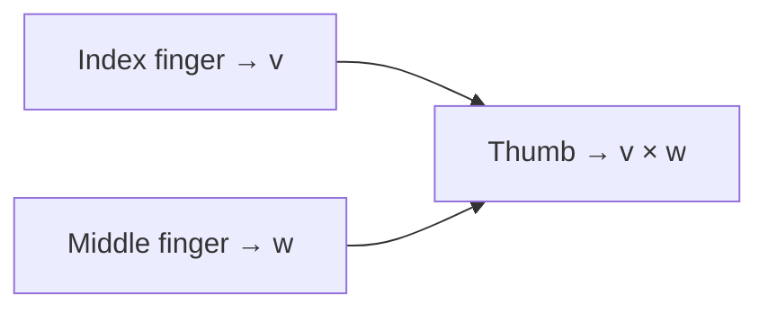
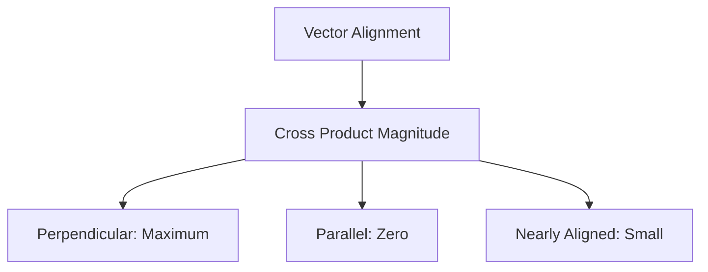

## 2D Cross Product (Simplified Version)

### Basic Definition

- Given two vectors **v** and **w**, their cross product represents the ==**area of the parallelogram**== they span
- The parallelogram is formed by placing copies of each vector at the tip of the other

### Orientation Matters

- **v × w is positive** when v is on the right of w
- **v × w is negative** when v is on the left of w
- Order matters: **w × v = -(v × w)**
- Remember: **î × ĵ = positive** (i-hat on the right of j-hat defines positive orientation)

### Computing 2D Cross Product

Use the [[Determinant]] of a 2×2 matrix:

1. Place v's coordinates as the first column
2. Place w's coordinates as the second column
3. Calculate the determinant

> [!example] Example: v = (-3, 1), w = (2, 1) $$\det\begin{bmatrix}-3 & 2 \\ 1 & 1\end{bmatrix} = (-3)(1) - (2)(1) = -5$$ Area = 5, but negative because v is on the left of w

### Why Determinant Works

- The matrix represents a [[Linear Transformation]] moving î and ĵ to v and w
- Determinant measures how areas change under transformation
- The unit square on î and ĵ becomes the parallelogram spanned by v and w
- Negative determinant indicates flipped orientation

---

## 3D Cross Product (True Cross Product)

### Key Difference

> [!important] The 3D cross product produces a **vector**, not a scalar

### Properties of the Result Vector

1. **Length** = area of the parallelogram spanned by v and w
2. **Direction** = perpendicular to both v and w
3. **Orientation** = determined by the right-hand rule

### Right-Hand Rule

1. Point index finger in direction of **v**
2. Point middle finger in direction of **w**
3. Thumb points in direction of **v × w**

### Example

- $\vec{v} = 2\hat{k}$ (length 2, pointing up in z-direction)
- $\vec{w} = 2\hat{j}$ (length 2, pointing in y-direction)
- Parallelogram is a square with area 4
- Using right-hand rule: $\vec{v} \times \vec{w} = -4\hat{i}$ (points in negative x-direction)

---

## Computing 3D Cross Product

### The "Strange" Formula

Create a 3×3 matrix:

$$\begin{vmatrix} \hat{i} & v_1 & w_1\\ \hat{j} & v_2 & w_2\\ \hat{k} & v_3 & w_3 \end{vmatrix}$$

- **First column**: basis vectors î, ĵ, k̂
- **Second column**: coordinates of v
- **Third column**: coordinates of w

> [!note] Calculate the determinant treating basis vectors as if they were numbers. The result is a linear combination of basis vectors.

### Why This Works

- Not just a notational trick!
- Connected to the concept of [[Duality]] (vectors ↔ linear transformations)
- The determinant naturally encodes both magnitude (area) and orientation

---

## Geometric Intuition

### Area Relationships

- **Perpendicular vectors** → larger cross product (maximum area)
- **Parallel vectors** → zero cross product (no area)
- **Nearly aligned vectors** → small cross product

### Scaling Property

$$(c\vec{v}) \times \vec{w} = c(\vec{v} \times \vec{w})$$

This follows from how scaling affects parallelogram area

---

## Key Takeaways

> [!summary]
> 
> 1. **2D cross product** = signed area (scalar)
> 2. **3D cross product** = vector perpendicular to both inputs
> 3. **Order matters** due to orientation
> 4. **Determinant** is fundamental to both versions
> 5. The seemingly strange notation with basis vectors in the matrix actually reflects deep mathematical structure ([[Duality]])

---

## Applications

- [ ] Calculating areas and volumes
- [ ] Finding perpendicular directions
- [ ] Testing orientation/handedness
- [ ] Physics: torque, angular momentum
- [ ] Computer graphics: surface normals

---

## Related Topics

- [[Chapter 9 - Dot Products and Duality]]
- [[Chapter 6 - The Determinant]]]
- [[Chapter 3 - Linear Transformations and Matrices]]]
- [[Chapter 9 - Dot Products and Duality]]]

#linear-algebra #vectors #cross-product #3D-geometry
